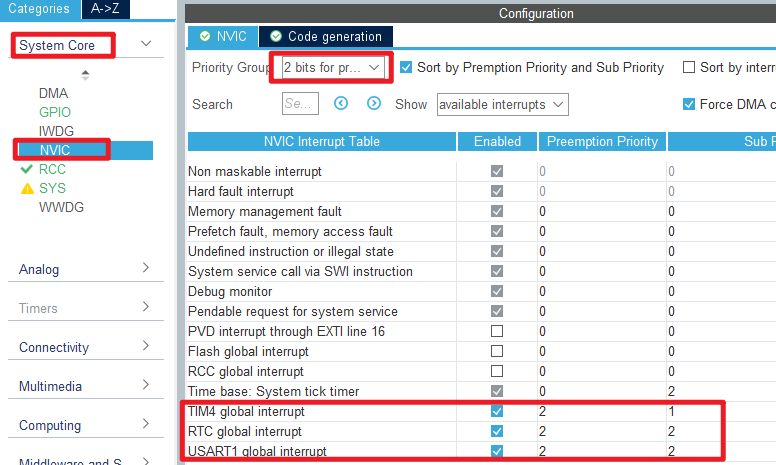
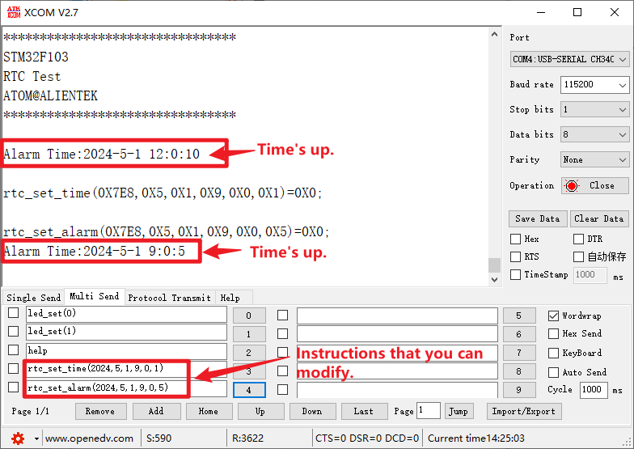

## RTC example<a name="brief"></a>

### 1 Brief
The function of this code is to generate an RTC wake-up interrupt every second.
### 2 Hardware Hookup
The hardware resources used in this example are:
+ LED0 - PB5
+ LED1 - PE5
+ USART1 - PA9/PA10
+ RTC
+ ALIENTEK  2.8/3.5/4.3/7 inch TFTLCD module

The RTC used in this example is the on-chip resource of STM32F103, so there is no corresponding connection schematic.

### 3 STM32CubeIDE Configuration


Let's copy the project from  **11_usmart** and name both the project and the.ioc file **12_rtc**. Next we start the RTC configuration by double-clicking the **12_rtc.ioc** file.

First click **Clock Configuration** and set it as shown below.


Open **Timers > RTC** as shown below.


Open **NVIC** configuration as shown below.



Click **File > Save**, and you will be asked to generate code.Click **Yes**.

##### code
###### rtc.c
We added a lot of code to rtc.c, so you can open the source code to have a look, but here are the important ones:
```c#
uint8_t rtc_set_time(uint16_t syear, uint8_t smon, uint8_t sday, uint8_t hour, uint8_t min, uint8_t sec)
{
	uint32_t seccount = 0;

	seccount = rtc_date2sec(syear, smon, sday, hour, min, sec); /* Converts the year, month, day, hour, minute, and second to a total number of seconds */

	__HAL_RCC_PWR_CLK_ENABLE(); /* Enable the power clock */
	__HAL_RCC_BKP_CLK_ENABLE(); /* Enable the backup domain clock */
	HAL_PWR_EnableBkUpAccess(); /* Disable backup domain write protection */

	RTC->CRL |= 1 << 4;         /* Enable configuration */

	RTC->CNTL = seccount & 0xffff;
	RTC->CNTH = seccount >> 16;

	RTC->CRL &= ~(1 << 4);      /* Configuration updates */

	while (!__HAL_RTC_ALARM_GET_FLAG(&hrtc, RTC_FLAG_RTOFF));   /* Wait for the RTC register operation to complete, that is, wait for RTOFF == 1 */

	return 0;
}
```
The preceding function is used to set a time.We input a time that will be used as a baseline for subsequent calculations.

```c#
void rtc_get_time(void)
{
    static uint16_t daycnt = 0;
    uint32_t seccount = 0;
    uint32_t temp = 0;
    uint16_t temp1 = 0;
    const uint8_t month_table[12] = {31, 28, 31, 30, 31, 30, 31, 31, 30, 31, 30, 31}; /* Calendar of the month and date of the year */

    seccount = RTC->CNTH;       /* Get the value in the counter (seconds) */
    seccount <<= 16;
    seccount += RTC->CNTL;

    temp = seccount / 86400;    /* Get the day (as a number of seconds) */

    if (daycnt != temp)         /* It's been over a day. */
    {
        daycnt = temp;
        temp1 = 1970;           /* It started in 1970 */

        while (temp >= 365)
        {
            if (rtc_is_leap_year(temp1)) /* It's a leap year */
            {
                if (temp >= 366)
                {
                    temp -= 366; /* The number of seconds in a leap year */
                }
                else
                {
                    break;
                }
            }
            else
            {
                temp -= 365;    /* nonleap year */
            }

            temp1++;
        }

        g_calendar.year = temp1;/* Get the year */
        temp1 = 0;

        while (temp >= 28)      /* More than a month */
        {
            if (rtc_is_leap_year(g_calendar.year) && temp1 == 1) /* Is it a leap year/February */
            {
                if (temp >= 29)
                {
                    temp -= 29; /* The number of seconds in a leap year */
                }
                else
                {
                    break;
                }
            }
            else
            {
                if (temp >= month_table[temp1])
                {
                    temp -= month_table[temp1]; /* nonleap year */
                }
                else
                {
                    break;
                }
            }

            temp1++;
        }

        g_calendar.month = temp1 + 1; /* Get the month */
        g_calendar.date = temp + 1;   /* Get the date */
    }

    temp = seccount % 86400;                                                    /* Get the number of seconds */
    g_calendar.hour = temp / 3600;
    g_calendar.min = (temp % 3600) / 60;
    g_calendar.sec = (temp % 3600) % 60;
    g_calendar.week = rtc_get_week(g_calendar.year, g_calendar.month, g_calendar.date); /* get week */
}
```
The code utilizes a ``calendar`` struct to store information such as the year, month, day, hour, minute, and second of a clock. We store the computed values inside the ``calendar`` for easy access by other functions.

###### main.c
Add some codes between the /* USER CODE */ guards as follow:
```c#
int main(void)
{
  /* USER CODE BEGIN 1 */
  uint8_t t = 0;
  char tbuf[40];
  /* USER CODE END 1 */

  /* MCU Configuration--------------------------------------------------------*/

  /* Reset of all peripherals, Initializes the Flash interface and the Systick. */
  HAL_Init();

  /* USER CODE BEGIN Init */

  /* USER CODE END Init */

  /* Configure the system clock */
  SystemClock_Config();

  /* USER CODE BEGIN SysInit */

  /* USER CODE END SysInit */

  /* Initialize all configured peripherals */
  MX_GPIO_Init();
  MX_USART1_UART_Init();
  MX_FSMC_Init();
  MX_TIM4_Init();
  MX_RTC_Init();
  /* USER CODE BEGIN 2 */
  
  lcd_init();                                  /* Initialize LCD */
  stm32f103ze_show_mesg();

  lcd_show_string(30, 50, 200, 16, 16, "STM32", RED);
  lcd_show_string(30, 70, 200, 16, 16, "RTC TEST", RED);
  lcd_show_string(30, 90, 200, 16, 16, "ATOM@ALIENTEK", RED);

  rtc_set_alarm(2024, 5, 1, 12, 0, 10);        /* Set an alarm */
  /* USER CODE END 2 */

  /* Infinite loop */
  /* USER CODE BEGIN WHILE */
  while (1)
  {
	  t++;

    if ((t % 10) == 0)
    {
        /* Get the RTC time information */
        rtc_get_time();
        sprintf(tbuf, "Time:%02d:%02d:%02d", g_calendar.hour, g_calendar.min, g_calendar.sec);
        lcd_show_string(30, 120, 210, 16, 16, tbuf, RED);
        sprintf(tbuf, "Date:%04d-%02d-%02d", g_calendar.year, g_calendar.month, g_calendar.date);
        lcd_show_string(30, 140, 210, 16, 16, tbuf, RED);
        sprintf(tbuf, "Week:%s", weekdays[g_calendar.week]);
        lcd_show_string(30, 160, 210, 16, 16, tbuf, RED);
    }

    if (t == 20)
    {
        t = 0;
        LED0_TOGGLE();   /* LED0 blinks to indicate that the program is running */
    }

    HAL_Delay(10);       /* delay 10ms */
    /* USER CODE END WHILE */

    /* USER CODE BEGIN 3 */
  }
  /* USER CODE END 3 */
}
```

###### usmart_port.c
In order to facilitate the call verification of RTC-related functions, **usmart_nametab** is modified in this file as follows:
```c#
struct _m_usmart_nametab usmart_nametab[] =
{
#if USMART_USE_WRFUNS == 1      /* If read and write operations are enabled */
    {(void *)read_addr, "uint32_t read_addr(uint32_t addr)"},
    {(void *)write_addr, "void write_addr(uint32_t addr,uint32_t val)"},
#endif
    {(void *)rtc_read_bkr, "uint16_t rtc_read_bkr(uint32_t bkrx)"},
    {(void *)rtc_write_bkr, "void rtc_write_bkr(uint32_t bkrx, uint16_t data)"},
    {(void *)rtc_get_week, "uint8_t rtc_get_week(uint16_t year, uint8_t month, uint8_t day)"},
    {(void *)rtc_set_time, "uint8_t rtc_set_time(uint16_t syear, uint8_t smon, uint8_t sday, uint8_t hour, uint8_t min, uint8_t sec)"},
    {(void *)rtc_set_alarm, "uint8_t rtc_set_alarm(uint16_t syear, uint8_t smon, uint8_t sday, uint8_t hour, uint8_t min, uint8_t sec)"},
};
```
The related functions of RTC are added to USMART, so that RTC time and alarm clock can be set directly through the serial port.


### 4 Running

#### 4.1 Compile & Download

After the compilation is complete, connect the DAP and the Mini Board, and then connect to the computer together to download the program to the Mini Board.

#### 4.2 Phenomenon

Press the **RESET** button to begin running the program on your Mini Board, observe the LED0 flashing on the Mini Board, open the serial port and the host computer **ATK-XCOM** can see the prompt information of the example, indicating that the code download is successful. We use the serial port to debug the RTC phenomenon as shown below:



[jump to title](#brief)