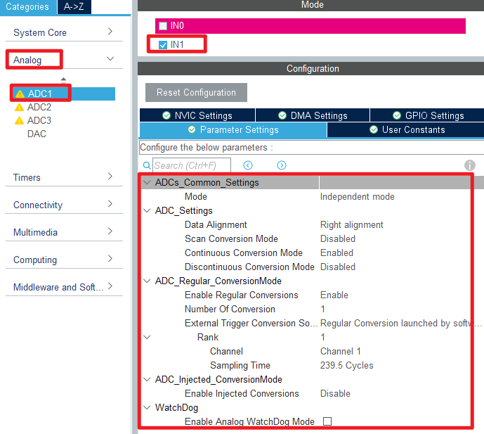
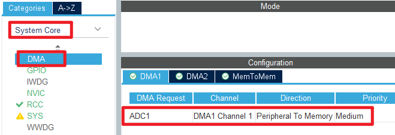
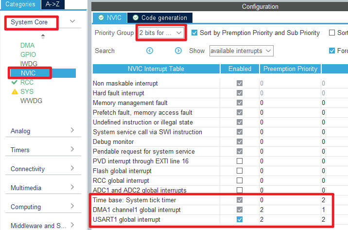
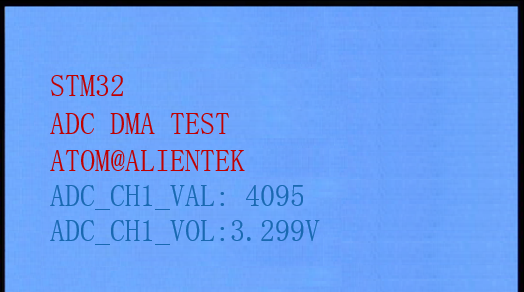

## ADC_DMA_Single_Channel example<a name="brief"></a>

### 1 Brief
The function of this code is to collect the voltage on the ADC channel 1 through DMA, and display the digital amount of the voltage converted by the ADC and the analog amount converted on the LCD module screen.
### 2 Hardware Hookup
The hardware resources used in this example are:
+ LED0 - PB5
+ USART1 - PA9/PA10
+ ADC1 - Channel1(PA1)
+ DMA1 - Channel1
+ ALIENTEK  2.8/3.5/4.3/7 inch TFTLCD module

The ADC used in this example is an on-chip resource of STM32F103, so there is no corresponding connection schematic.

### 3 STM32CubeIDE Configuration

We copy the previous chapter project and name both the project and the.ioc file **15_2_adc_dma_single_channel**.Next we start the ADC configuration by double-clicking the **15_2_adc_dma_single_channel.ioc** file.

Since our implementation is based on the previous project, the ADC pin does not need to be configured again, and we mainly modify the ADC parameters and configure the DMA.

Click **Analog > ADC1** to set.



In this example, DMA is used to transfer data, and the configuration is shown in the following figure.



Then configure the interrupt priority for DMA.



Click **File > Save**, and you will be asked to generate code.Click **Yes**.

##### code
We add some code to the adc.c file.First, we add code to the ADC1 initialization function ``MX_ADC1_Init``, as follows.
###### adc.c
```c#
  /* USER CODE BEGIN ADC1_Init 2 */
  HAL_ADCEx_Calibration_Start(&hadc1);   /* Calibration ADC */
  /* USER CODE END ADC1_Init 2 */
```
This line of code is added to the initialization function to calibrate the ADC.

A separate function is also added as follows.
```c#
void adc_dma_enable(uint16_t cndtr)
{
    ADC1->CR2 &= ~(1 << 0);                 /* Turn off the ADC first */

    DMA1_Channel1->CCR &= ~(1 << 0);        /* Turn off DMA transfers */
    while (DMA1_Channel1->CCR & (1 << 0));  /* Make sure DMA can be set */
    DMA1_Channel1->CNDTR = cndtr;           /* Amount of data transferred by DMA */
    DMA1_Channel1->CCR |= 1 << 0;           /* Enable DMA transfer */

    ADC1->CR2 |= 1 << 0;                    /* Restart the ADC */
    ADC1->CR2 |= 1 << 22;                   /* Start the rule transition channel */
}
```
The above code is used to DMA transfer completion callback function.

###### main.c
Your finished main() function should look like the following:
```c#
int main(void)
{
  /* USER CODE BEGIN 1 */

	uint16_t i;
	uint16_t adcx;
	uint32_t sum;
	float temp;

  /* USER CODE END 1 */

  /* MCU Configuration--------------------------------------------------------*/

  /* Reset of all peripherals, Initializes the Flash interface and the Systick. */
  HAL_Init();

  /* USER CODE BEGIN Init */

  /* USER CODE END Init */

  /* Configure the system clock */
  SystemClock_Config();

  /* USER CODE BEGIN SysInit */

  /* USER CODE END SysInit */

  /* Initialize all configured peripherals */
  MX_GPIO_Init();
  MX_DMA_Init();
  MX_USART1_UART_Init();
  MX_FSMC_Init();
  MX_ADC1_Init();
  /* USER CODE BEGIN 2 */

  lcd_init();
  lcd_show_string(30, 50, 200, 16, 16, "STM32", RED);
  lcd_show_string(30, 70, 200, 16, 16, "ADC DMA TEST", RED);
  lcd_show_string(30, 90, 200, 16, 16, "ATOM@ALIENTEK", RED);

  lcd_show_string(30, 110, 200, 16, 16, "ADC1_CH1_VAL:0", BLUE);
  lcd_show_string(30, 130, 200, 16, 16, "ADC1_CH1_VOL:0.000V", BLUE);

  HAL_DMA_Start_IT(&hdma_adc1, (uint32_t)&ADC1->DR, (uint32_t)&g_adc_dma_buf, 0);	/* Start DMA and enable interrupt */
  HAL_ADC_Start_DMA(&hadc1, (uint32_t*)&g_adc_dma_buf, 0);           				/* Turn on the ADC and transmit the result via DMA */

  adc_dma_enable(ADC_DMA_BUF_SIZE);   /* Turn on the ADC and transmit the result by DMA */

  /* USER CODE END 2 */

  /* Infinite loop */
  /* USER CODE BEGIN WHILE */
  while (1)
  {
    /* USER CODE END WHILE */
      if (g_adc_dma_sta == 1)
      {
          /* Calculate the average value of ADC data collected by DMA */
          sum = 0;

          for (i = 0; i < ADC_DMA_BUF_SIZE; i++)          /* Accumulation */
          {
              sum += g_adc_dma_buf[i];
          }

          adcx = sum / ADC_DMA_BUF_SIZE;               	  /* Averaging */

          /* Displaying results */
          lcd_show_xnum(134, 110, adcx, 4, 16, 0, BLUE);

          temp = (float)adcx * (3.3 / 4096);              /* Get the calculated actual voltage value with decimal values, such as 3.1111 */
          adcx = temp;                                    /* Assign the integer part to the adcx variable because adcx is integer u16 */
          lcd_show_xnum(134, 130, adcx, 1, 16, 0, BLUE);

          temp -= adcx;                                   /* Remove the integer part that is already displayed, leaving the decimal part */
          temp *= 1000;                                   /* Multiply the decimal part by 1000 */
          lcd_show_xnum(150, 130, temp, 3, 16, 0X80, BLUE);

          g_adc_dma_sta = 0;                              /* Clear the DMA collection completion status flag */
          adc_dma_enable(ADC_DMA_BUF_SIZE);               /* Start the next ADC DMA acquisition */
      }

    LED0_TOGGLE();                                        /* LED0 state is flipped */
    HAL_Delay(100);
    /* USER CODE END WHILE */

    /* USER CODE BEGIN 3 */
  }
  /* USER CODE END 3 */
}
```
This section of code is very similar to the ADC acquisition example in the previous chapter, except that DMA transfer is enabled. DMA transfers are stored in the **g_adc_dma_buf** array, which is averaged to reduce error.


### 4 Running
#### 4.1 Compile & Download
After the compilation is complete, connect the DAP and the Mini Board, and then connect to the computer together to download the program to the Mini Board.
#### 4.2 Phenomenon
Press the **RESET** button to begin running the program on your Mini Board, observe the LED0 flashing on the Mini Board, indicating that the code download is successful. When a dupont wire is used to connect the PA1 pin with different voltage values, the digital and analog voltage of the LCD screen will also change. **It should be noted that the input voltage cannot exceed the 3.3V threshold of the Mini Board**, otherwise it may damage the Mini Board. The phenomenon is illustrated in the following figure:



[jump to title](#brief)