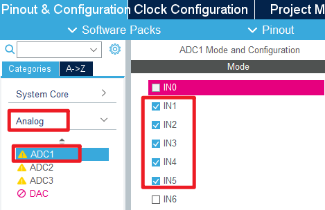
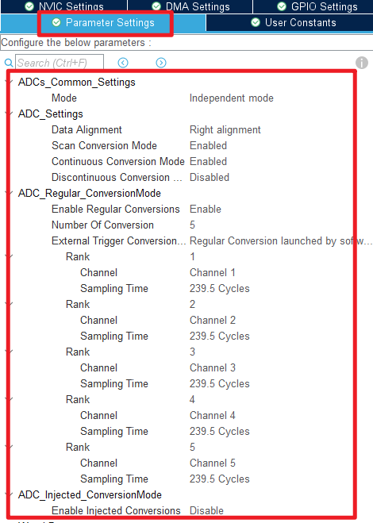
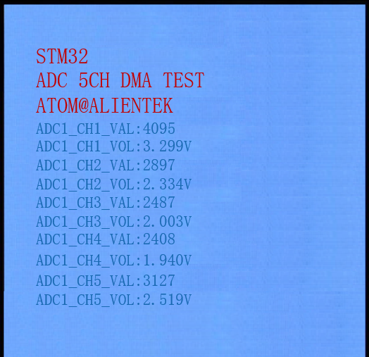

## ADC_DMA_Multi_Channel example<a name="brief"></a>

### 1 Brief
The function of this code is to collect the voltage on channel 1 to channel 5 of ADC through DMA, and display the digital amount of the voltage converted by ADC and the analog amount converted by ADC on the LCD module screen.
### 2 Hardware Hookup
The hardware resources used in this example are:
+ LED0 - PB5
+ USART1 - PA9/PA10
+ ADC1 - Channel1(PA1)
+ ADC1 - Channel2(PA2)
+ ADC1 - Channel3(PA3)
+ ADC1 - Channel4(PA4)
+ ADC1 - Channel5(PA5)
+ ALIENTEK  2.8/3.5/4.3/7 inch TFTLCD module

The ADC used in this example is an on-chip resource of STM32F103, so there is no corresponding connection schematic.

### 3 STM32CubeIDE Configuration

We copy the previous chapter project and name both the project and the.ioc file **15_3_adc_dma_multi_channel**.Next we start the ADC configuration by double-clicking the **15_3_adc_dma_multi_channel.ioc** file.

Since this example uses one more ADC channel than the example in the previous chapter, the ADC channel needs to be reconfigured.
Click **Analog > ADC1** to set. 



Next are the ADC1 parameters, as shown in the following screenshot.



Click **File > Save**, and you will be asked to generate code.Click **Yes**.

The code for the ADC and DMA is the same as in the previous chapter, but we have already covered them and will not repeat them here.

##### code
###### main.c
Here's the code in the main function.
```c#
/* USER CODE BEGIN PV */
#define ADC_DMA_BUF_SIZE      5 * 50             /* ADC DMA buffer size */
static uint16_t g_adc_dma_buf[ADC_DMA_BUF_SIZE]; /* ADC DMA buffer */

extern uint8_t g_adc_dma_sta; /* DMA transfer completion flag */
/* USER CODE END PV */
int main(void)
{
  /* USER CODE BEGIN 1 */

  uint16_t i, j;
  uint16_t adcx;
  uint32_t sum;
  float temp;

  /* USER CODE END 1 */

  /* MCU Configuration--------------------------------------------------------*/

  /* Reset of all peripherals, Initializes the Flash interface and the Systick. */
  HAL_Init();

  /* USER CODE BEGIN Init */

  /* USER CODE END Init */

  /* Configure the system clock */
  SystemClock_Config();

  /* USER CODE BEGIN SysInit */

  /* USER CODE END SysInit */

  /* Initialize all configured peripherals */
  MX_GPIO_Init();
  MX_DMA_Init();
  MX_USART1_UART_Init();
  MX_FSMC_Init();
  MX_ADC1_Init();
  /* USER CODE BEGIN 2 */

  HAL_DMA_Start_IT(&hdma_adc1, (uint32_t)&ADC1->DR, (uint32_t)&g_adc_dma_buf, 0);  /* Start DMA and enable interrupt */
  HAL_ADC_Start_DMA(&hadc1, (uint32_t*)&g_adc_dma_buf, 0);                         /* Turn on the ADC and transmit the result via DMA */

  lcd_init();

  lcd_show_string(30, 50, 200, 16, 16, "STM32", RED);
  lcd_show_string(30, 70, 200, 16, 16, "ADC 5CH DMA TEST", RED);
  lcd_show_string(30, 90, 200, 16, 16, "ATOM@ALIENTEK", RED);
  lcd_show_string(30, 110, 200, 12, 12, "ADC1_CH1_VAL:", BLUE);
  lcd_show_string(30, 122, 200, 12, 12, "ADC1_CH1_VOL:0.000V", BLUE);
  lcd_show_string(30, 140, 200, 12, 12, "ADC1_CH2_VAL:", BLUE);
  lcd_show_string(30, 152, 200, 12, 12, "ADC1_CH2_VOL:0.000V", BLUE);
  lcd_show_string(30, 170, 200, 12, 12, "ADC1_CH3_VAL:", BLUE);
  lcd_show_string(30, 182, 200, 12, 12, "ADC1_CH3_VOL:0.000V", BLUE);
  lcd_show_string(30, 200, 200, 12, 12, "ADC1_CH4_VAL:", BLUE);
  lcd_show_string(30, 212, 200, 12, 12, "ADC1_CH4_VOL:0.000V", BLUE);
  lcd_show_string(30, 230, 200, 12, 12, "ADC1_CH5_VAL:", BLUE);
  lcd_show_string(30, 242, 200, 12, 12, "ADC1_CH5_VOL:0.000V", BLUE);

  adc_dma_enable(ADC_DMA_BUF_SIZE);   /* Turn on the ADC and transmit the result by DMA */

  /* USER CODE END 2 */

  /* Infinite loop */
  /* USER CODE BEGIN WHILE */
  while (1)
  {
    /* USER CODE END WHILE */

      if (g_adc_dma_sta == 1)
      {
        /* Loop through and display the results from Channel 4 to Channel 5. */

        for(j = 0; j < 5; j++)        /* Traverse five channels */
        {
          sum = 0;                    /* Reset to zero */

          /* Each channel collected data 10 times and performed 10 accumulations */
          for (i = 0; i < ADC_DMA_BUF_SIZE / 5; i++)
          {
            sum += g_adc_dma_buf[(5 * i) + j];    /* Accumulate conversion data from the same channel. */
          }

          adcx = sum / (ADC_DMA_BUF_SIZE / 5);    /* Calculate the average. */

          /* Display the results */
          lcd_show_xnum(108, 110 + (j * 30), adcx, 4, 12, 0, BLUE);
          temp = (float)adcx * (3.3 / 4096);      /* Calculated actual voltage values with decimals */
          adcx = temp;                            /* Assign the integer part to the variable 'adcx' */
          lcd_show_xnum(108, 122 + (j * 30), adcx, 1, 12, 0, BLUE);

          temp -= adcx;
          temp *= 1000;
          lcd_show_xnum(120, 122 + (j * 30), temp, 3, 12, 0X80, BLUE);
        }

        g_adc_dma_sta = 0;                        /* Clear the DMA completion status flag. */
        adc_dma_enable(ADC_DMA_BUF_SIZE);         /* Start the next ADC DMA acquisition. */
      }

      LED0_TOGGLE();                              /* LED0 state is flipped */
      HAL_Delay(100);
    /* USER CODE END WHILE */

    /* USER CODE BEGIN 3 */
  }
  /* USER CODE END 3 */
}
```
The code in this section is very similar to that in the previous chapter.The data for DMA transfers are stored in the **g_adc_dma_buf** array-two channels are used in this case, so a larger DMA transfer destination memory is required. Each channel uses 50 uint16_t of space for the ADC data. To reduce error, we take the average of the data in the array.


### 4 Running
#### 4.1 Compile & Download
After the compilation is complete, connect the DAP and the Mini Board, and then connect to the computer together to download the program to the Mini Board.
#### 4.2 Phenomenon
Press the **RESET** button to begin running the program on your Mini Board, observe the LED0 flashing on the Mini Board, indicating that the code download is successful. When the dupont line is used to connect the pins with different voltage values, the digital and analog voltage of the LCD screen will also change. **It should be noted that the input voltage cannot exceed the 3.3V threshold of the Mini Board**, otherwise it may damage the Mini Board. The phenomenon is illustrated in the following figure:



[jump to title](#brief)