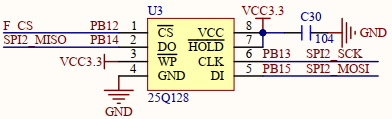
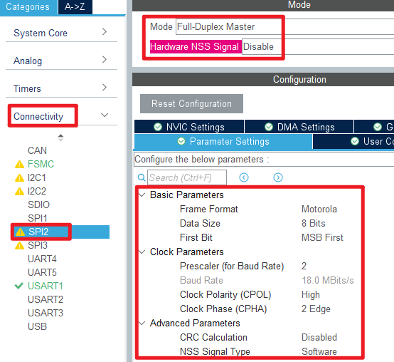
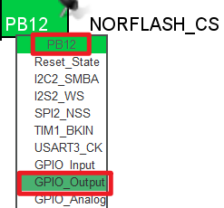
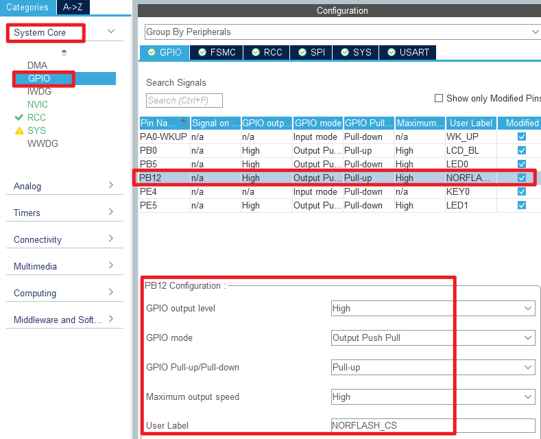
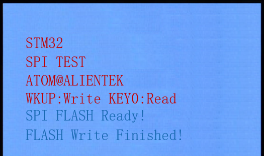
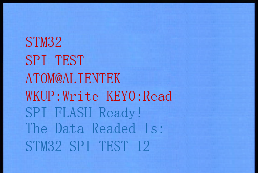

## RNG example<a name="brief"></a>


### 1 Brief
The function of this example is to control the writing of norflash by the WKUP key, and to control the reading of norflash by the KEY0 key, and to display relevant information on the LCD module.
### 2 Hardware Hookup
The hardware resources used in this example are:
+ LED0 - PB5
+ USART1 - PA9/PA10
+ KEY - WKUP(PA0)
+ KEY - KEY0(PE4)
+ ALIENTEK  2.8/3.5/4.3/7 inch TFTLCD module

The connection between the norflash and the Mini Board is shown in the following diagram.



### 3 STM32CubeIDE Configuration


We copy the **10_tftlcd** project and name both the project and the.ioc file **19_spi**.Next we start the DAC configuration by double-clicking the **19_spi.ioc** file.

Click **Connectivity -> SPI2**, config as below:




In **Pinout&Configuration**, select the slice selection pin. Click **PB12** pin to set mode.



The detailed configuration of pins is as follows.



Click **File > Save**, and you will be asked to generate code.Click **Yes**.

##### code

We will add the NORFLASH-driver file ``norflash.c/norflash.h``.

###### spi.c
In the SPI file, we add the speed setting function, which is realized by means of registers. In addition, the built-in functions of HAL library are called to receive and send operations.
```c#
void spi2_set_speed(uint8_t speed)
{
    assert_param(IS_SPI_BAUDRATE_PRESCALER(speed)); /* Judging validity */
    __HAL_SPI_DISABLE(&hspi2);                      /* Turn off SPI */
    hspi2.Instance->CR1 &= 0XFFC7;                  /* Bits 3-5 are reset to set the baud rate */
    hspi2.Instance->CR1 |= speed << 3;              /* Set SPI speed */
    __HAL_SPI_ENABLE(&hspi2);                       /* Enable SPI */
}

/**
 * @brief   SPI2 reads and writes one byte of data
 * @param   txdata: The data to send (1 byte)
 * @retval  received data (1 byte)
 */
uint8_t spi2_read_write_byte(uint8_t txdata)
{
    uint8_t rxdata;
    HAL_SPI_TransmitReceive(&hspi2, &txdata, &rxdata, 1, 1000);
    return rxdata; /* Returns the received data */
}
```

###### norflash.c
In the norflash driver is a variety of norflash operations, including reading, writing and erasing.

```c#
void norflash_init(void)
{
    uint8_t temp;

    NORFLASH_CS(1);                      /* Unselect a movie */

    MX_SPI2_Init();                   	 /* Initialize SPI2 */
    spi2_set_speed(SPI_SPEED_2);         /* SPI2 switches to a high-speed state of 18Mhz */

    g_norflash_type = norflash_read_id();/* Reading FLASH ID */
    printf("ID:%x\r\n",g_norflash_type);
    if (g_norflash_type == W25Q256)      /* The SPI FLASH is W25Q256 and must enable 4-byte address mode */
    {
        temp = norflash_read_sr(3);      /* Read status register 3 to determine the address pattern */

        if ((temp & 0X01) == 0)          /* If it is not 4-byte address mode, it enters 4-byte address mode */
        {
            norflash_write_enable();     /* Write enable */
            temp |= 1 << 1;              /* ADP=1, power on 4-bit address mode */
            norflash_write_sr(3, temp);  /* Write SR3 */

            NORFLASH_CS(0);
            spi2_read_write_byte(FLASH_Enable4ByteAddr);    /* Enable 4-byte address instructions */
            NORFLASH_CS(1);
        }
    }
}
```

###### main.c
```c#
int main(void)
{
  /* USER CODE BEGIN 1 */
  uint8_t t = 0;
  uint8_t key;
  uint8_t data[TEXT_SIZE];
  uint16_t id;
  uint32_t flashsize;
  /* USER CODE END 1 */

  /* MCU Configuration--------------------------------------------------------*/

  /* Reset of all peripherals, Initializes the Flash interface and the Systick. */
  HAL_Init();

  /* USER CODE BEGIN Init */

  /* USER CODE END Init */

  /* Configure the system clock */
  SystemClock_Config();

  /* USER CODE BEGIN SysInit */

  /* USER CODE END SysInit */

  /* Initialize all configured peripherals */
  MX_GPIO_Init();
  MX_USART1_UART_Init();
  MX_FSMC_Init();
  MX_SPI2_Init();
  /* USER CODE BEGIN 2 */

  lcd_init();                      /* Initialize LCD */
  norflash_init();                 /* Initialize NORFLASH */

  lcd_show_string(30,  50, 200, 16, 16, "STM32", RED);
  lcd_show_string(30,  70, 200, 16, 16, "SPI TEST", RED);
  lcd_show_string(30,  90, 200, 16, 16, "ATOM@ALIENTEK", RED);
  lcd_show_string(30, 110, 200, 16, 16, "WKUP:Write  KEY0:Read", RED);

  id = norflash_read_id(); /* Reading FLASH ID */

  while ((id == 0) || (id == 0XFFFF)) /* The FLASH chip cannot be detected */
  {
      lcd_show_string(30, 130, 200, 16, 16, "FLASH Check Failed!", RED);
      HAL_Delay(500);
      lcd_show_string(30, 130, 200, 16, 16, "Please Check!      ", RED);
      HAL_Delay(500);
      LED1_TOGGLE();
  }

  lcd_show_string(30, 130, 200, 16, 16, "SPI FLASH Ready!", BLUE);
  flashsize = 16 * 1024 * 1024; /* The FLASH size is 16 megabytes */

  /* USER CODE END 2 */

  /* Infinite loop */
  /* USER CODE BEGIN WHILE */
  while (1)
  {
    key = key_scan(0);

    if (key == WKUP_PRES)
    {
        lcd_fill(0, 150, 239, 319, WHITE);
        lcd_show_string(30, 150, 200, 16, 16, "Start Write FLASH....", BLUE);
        norflash_write((uint8_t *)datatemp, flashsize - 100, TEXT_SIZE);      /* Starting at the 100th to last address, a SIZE is written */
        lcd_show_string(30, 150, 200, 16, 16, "FLASH Write Finished!", BLUE); /* Prompt transmission completed */
    }

    if (key == KEY0_PRES)
    {
        lcd_show_string(30, 150, 200, 16, 16, "Start Read FLASH... . ", BLUE);
        norflash_read(datatemp, flashsize - 100, TEXT_SIZE);                   /* Starting at the 100th address from the bottom, SIZE bytes are read out */
        lcd_show_string(30, 150, 200, 16, 16, "The Data Readed Is:   ", BLUE);
        lcd_show_string(30, 170, 200, 16, 16, (char *)datatemp, BLUE);         /* Displays the string read */
    }

    if (++t == 20)                          /* Enter once in 200ms. */
    {
        t = 0;
        LED0_TOGGLE();                      /* LED0 blinks to prompt the program to run */
    }

    HAL_Delay(10);                          /* delay 10ms */
    /* USER CODE END WHILE */

    /* USER CODE BEGIN 3 */
  }
  /* USER CODE END 3 */
}
```

### 4 Running
#### 4.1 Compile & Download
After the compilation is complete, connect the DAP and the Mini Board, and then connect to the computer together to download the program to the Mini Board.
#### 4.2 Phenomenon
Press the **RESET** button to begin running the program on your Mini Board, observe the LED0 flashing on the Mini Board, indicating that the code download is successful. 

Press WKUP to write data, and then press KEY0 to read data, and finally the contents of the LCD display as shown in the following figure:





[jump to title](#brief)